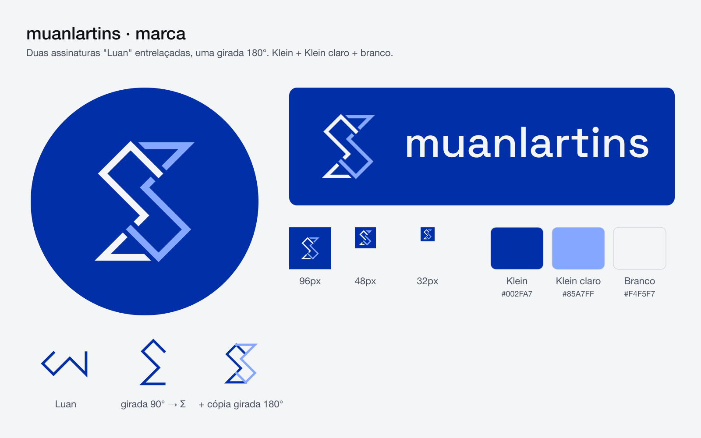

# muanlartins — brand



## The mark

The mark is my signature. "Luan" is written in one continuous stroke — L, U, A, N — and redrawn on a 45° lattice so every segment is either diagonal or vertical. Turned 90°, that stroke reads as a **Σ**: the sum, the first symbol you meet in statistics, which is what this project is about — measuring how you get better.

Two copies of it, one turned 180°, are glued together and woven over and under each other at the four points where they cross. The result is a point-symmetric **S** that, under the hood, is still just "Luan" twice.

- White copy over light-blue copy at two crossings, the reverse at the other two — the alternation is what keeps the 180° symmetry.
- Sharp miter corners and straight cuts at the crossings; no rounding.
- Both copies carry the same stroke weight. An optically compensated version (light-blue copy +7%) was tested in `explorations/v14-peso/` and rejected: the difference wasn't perceptible.

## Colors

| Name | Hex | Use |
|---|---|---|
| Klein | `#002FA7` | Ground. International Klein Blue. |
| Branco | `#F4F5F7` | Primary ink, the over copy. |
| Klein claro | `#85A7FF` | Accent, the under copy. Same hue and saturation as Klein (HSL 223° / 100%), lightness 76%. ~4.5:1 on Klein. |

The website extends this into a ramp of Klein tints (see `app/globals.css`).

## Typography

[Space Grotesk](https://fonts.google.com/specimen/Space+Grotesk) (SIL Open Font License, `fonts/OFL.txt`). The wordmark is `muanlartins`, lowercase, weight 500, outlined to paths so the SVGs render the same without the font installed.

## Files

| Path | What |
|---|---|
| `logo/mark.svg` | The mark, transparent background. |
| `logo/mark-on-klein.svg` | The mark on Klein. |
| `logo/avatar-800.png`, `logo/avatar-circle-800.png` | Profile pictures (square, and pre-cropped circle). |
| `logo/lockup.svg`, `logo/lockup-on-klein.svg`, `logo/lockup-on-klein-1600.png` | Mark + wordmark. |
| `small/mark-small.svg`, `small/mark-small-clear.svg`, `small/mark-{48,32}.png` | The small-size drawing: tighter crop, heavier stroke, wider gaps. Use it at 64px and below. |
| `small/favicon-16.svg`, `small/favicon-16.png` | 16px only: no weave, both copies white, pixel-snapped. |
| `small/favicon.ico` | 16 + 32 + 48 in one file. |
| `og/og-1200x630.png` | Social preview card (link previews on WhatsApp, X, LinkedIn…). |
| `youtube/profile-800.png` | YouTube profile picture (YouTube crops it to a circle). |
| `youtube/watermark-150.png` | Video watermark: the small drawing, on Klein so it reads over any footage. |
| `youtube/banner-2560x1440.png` | YouTube banner: the lockup on the mark's 45° lattice, lined up with its strokes. `banner-crops.png` shows what TVs, desktops and phones keep. |
| `brand-board.png` | Everything above on one page. |
| `explorations/` | How it got here — see its README. |

## Rules of thumb

- At 64px and below, use the `small/` drawing; at 16px, the favicon.
- Keep the mark on Klein or on a transparent background over Klein. On anything else, it needs the Klein ground behind it.
- Don't recolor the copies, round the corners, or rotate the mark — the 180° symmetry is the point.

## Regenerating

`build.py` is the source of truth: every file above, and the website's icons (`app/icon.svg`, `app/favicon.ico`, `app/apple-icon.png`, `app/opengraph-image.png`, `public/brand/`), comes out of it.

```bash
cd brand
python3 -m venv .venv && ./.venv/bin/pip install -r requirements.txt   # once
./.venv/bin/python build.py
```

Needs `rsvg-convert` (librsvg) and ImageMagick (`magick`): `brew install librsvg imagemagick`.
